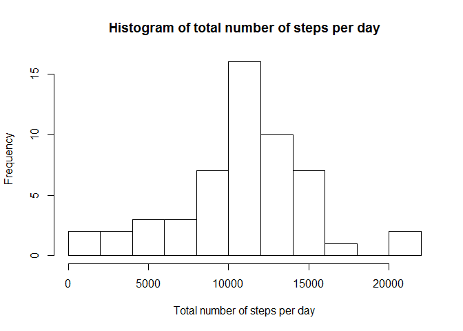
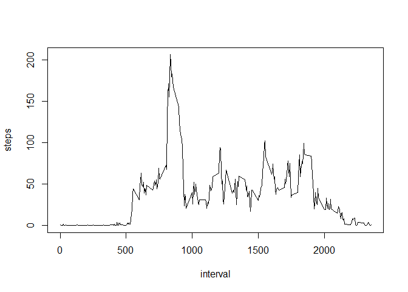
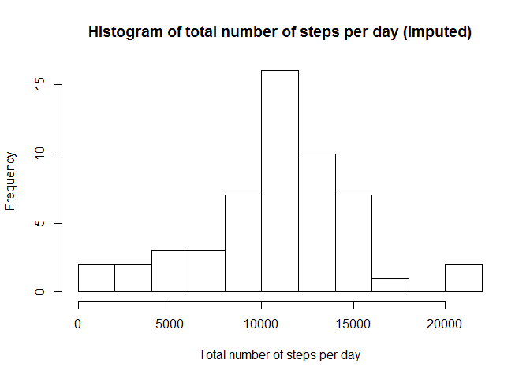
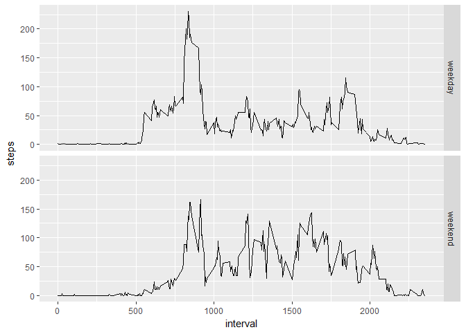

# Reproducible Research: Peer Assessment 1


## Loading and preprocessing the data


```r
temp <- tempfile()
download.file("https://d396qusza40orc.cloudfront.net/repdata%2Fdata%2Factivity.zip",temp)
data1 <- read.table(unz(temp, "activity.csv"), header = T, quote =  "\"", sep = ",")
unlink(temp) 

library(ggplot2)
```

```
## Warning: package 'ggplot2' was built under R version 3.4.2
```

```r
library(sqldf)
```

```
## Loading required package: gsubfn
```

```
## Loading required package: proto
```

```
## Loading required package: RSQLite
```


## What is mean total number of steps taken per day?


```r
data2 <- data1[complete.cases(data1), ]
total_steps_per_day <- sqldf("select date, sum(steps) as steps from data2 group by date")
hist(total_steps_per_day$steps, 
     breaks=10, 
     xlab = "Total number of steps per day", 
     main = "Histogram of total number of steps per day")
```

<!-- -->

```r
mean_steps_per_day   <- mean  (total_steps_per_day$steps, na.rm = TRUE)
median_steps_per_day <- median(total_steps_per_day$steps, na.rm = TRUE)
mean_steps_per_day
```

```
## [1] 10766.19
```

```r
median_steps_per_day 
```

```
## [1] 10765
```

## What is the average daily activity pattern?


```r
steps_per_interval <- sqldf("select interval, avg(steps) as steps from data2 group by interval")
plot(steps_per_interval, type = "l")
```

<!-- -->

```r
steps_per_interval[which.max(steps_per_interval$steps), ]
```

```
##     interval steps
## 104      835   206
```

## Imputing missing values


```r
sum(is.na(data1))
```

```
## [1] 2304
```

```r
data3 <- sqldf("select case when data1.steps is null 
                            then steps_per_interval.steps 
                            else data1.steps end as steps, 
                       data1.date, 
                       data1.interval 
                from data1 
                left join steps_per_interval on data1.interval = steps_per_interval.interval")

total_steps_per_day_imputed <- sqldf::sqldf("select date, sum(steps) as steps from data3 group by date")
hist(total_steps_per_day$steps, 
     breaks=10, 
     xlab = "Total number of steps per day", 
     main = "Histogram of total number of steps per day (imputed)")
```

<!-- -->

```r
mean_steps_per_day_imputed   <- mean  (total_steps_per_day_imputed$steps, na.rm = TRUE)
median_steps_per_day_imputed <- median(total_steps_per_day_imputed$steps, na.rm = TRUE)
mean_steps_per_day_imputed
```

```
## [1] 10749.77
```

```r
median_steps_per_day_imputed
```

```
## [1] 10641
```

## Are there differences in activity patterns between weekdays and weekends?


```r
data3$weekend<-ifelse(as.POSIXlt(data3$date)$wday %in% c(0, 6), "weekend", "weekday")
steps_per_interval_wd <- sqldf::sqldf("select weekend, interval, avg(steps) as steps from data3 group by weekend, interval")
ggplot(steps_per_interval_wd, aes(interval, steps)) + geom_line() + facet_grid(weekend ~ .)
```

<!-- -->
